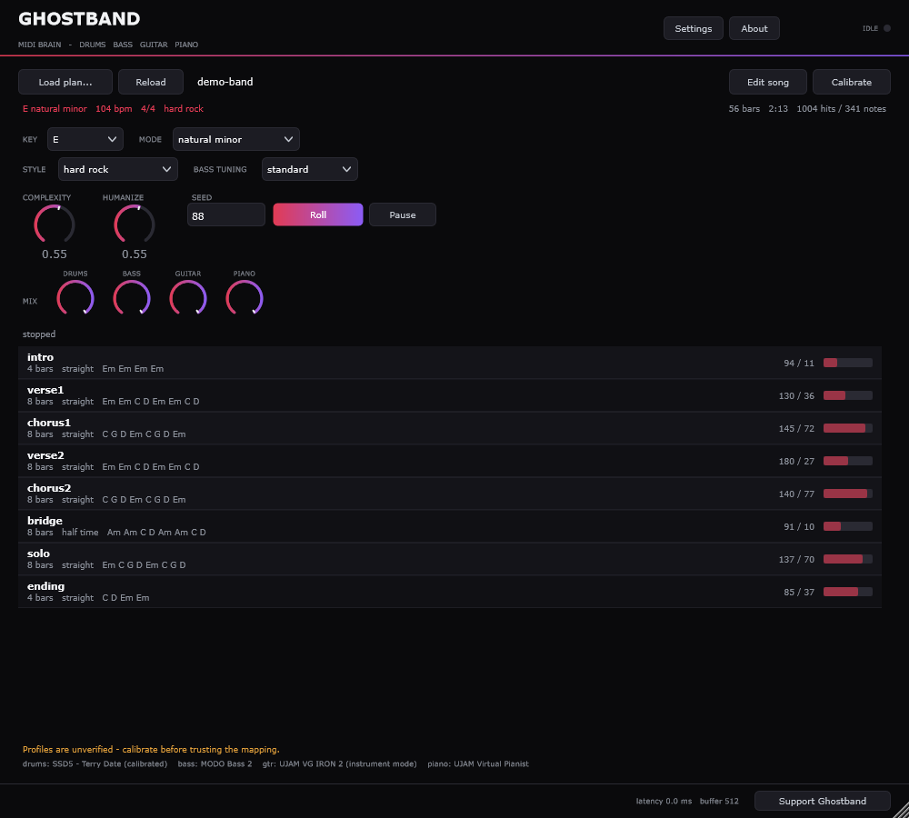
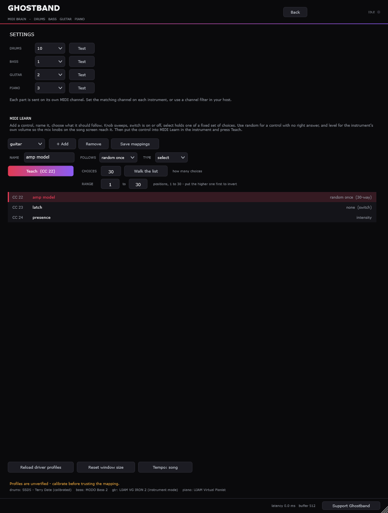
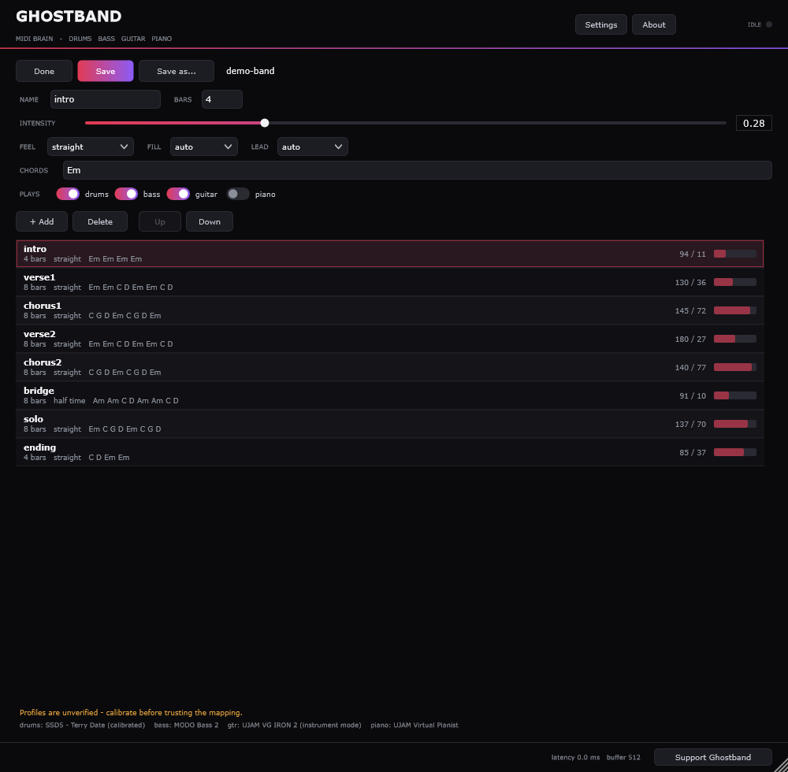
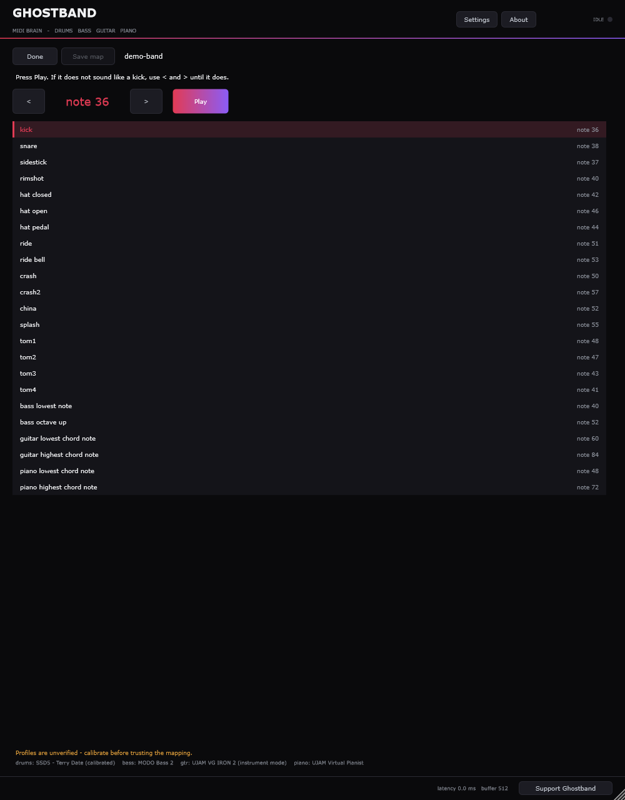
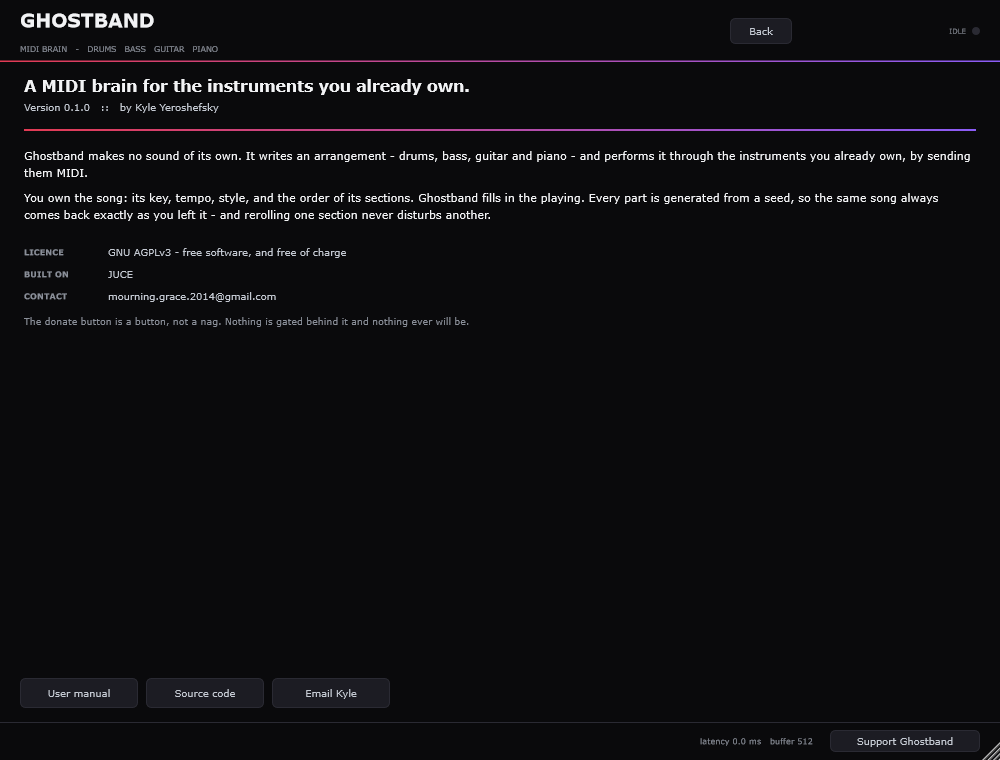

# Ghostband

A MIDI brain that plays *your* instrument plugins to build full songs.

Ghostband makes no sound of its own. It writes an arrangement and performs it
through instruments you already own — sending MIDI to a drum sampler, a bass, a
guitar, a piano — so the sounds are yours and the arranging is its job. It is a
VST3 that sits in a Gig Performer rackspace with its MIDI out wired to each
instrument.

**Status:** drums, bass, guitar and piano. Rock and metal. No live following yet.



*The song screen. Every section shows its chords, its feel, and how many drum hits and bass notes it actually plays.*

Ships with driver profiles for SSD5, MODO Bass 2, UJAM Virtual Guitarist IRON 2
and UJAM Virtual Pianist, plus a General MIDI fallback that works with most drum
plugins out of the box. Anything else is a small JSON file away, and the plugin
can calibrate an unknown instrument by ear.

Two things get built from the same engine:

- **`Ghostband.vst3`** — the plugin, for playing songs live.
- **`ghostband.exe`** — a CLI that renders the same arrangement to a `.mid` file.
  Mostly a test harness, and the reason the engine can be verified without a host.

They are held to producing byte-identical output; see *Determinism* below.

## Build

Needs CMake 3.20+ and an MSVC toolchain. JUCE is a pinned submodule, so clone
recursively:

```bash
git clone --recursive https://github.com/mourninggrace/Ghostband
cd Ghostband && Build.bat
```

Forgot `--recursive`? Run `git submodule update --init --recursive` — the build
says so rather than failing obscurely.

## The plugin

Copy `Ghostband.vst3` into your VST3 folder, then in a Gig Performer rackspace:

1. Add Ghostband and your instruments. **It ships with a plan built in**, so it
   has a song ready the moment it loads — no file needed to hear it work.
2. In the wiring view, drag from Ghostband's **orange MIDI output pin** to the
   MIDI input of SSD5 and MODO Bass 2. One output feeds many inputs.
3. Start the transport.

Drums go out on channel 10 and bass on channel 1 by default — both set by the
driver profiles, not hardcoded. Ghostband never touches audio; it passes through
untouched so the audio pins can be left unwired.

Note that a host holds the plugin DLL open while it is loaded, so **close the
host before reinstalling** or the copy will silently leave the old build behind.

### The songs it comes with

Eight presets ship inside the plugin, and **Load plan** opens on them. They are
deliberately not eight versions of the same song - each one is written to put a
different part of the arranger under load.

| Song | Style | Written to show |
|------|-------|-----------------|
| Terminal Velocity | thrash, 184 | Tightness. Humanize is deliberately low. |
| Brass Hour | hard rock, 92 | The lead handover - piano leads the verses, guitar takes the choruses. |
| Last Bus Home | punk, 178 | Restraint. No solo, no piano, under seventy seconds. |
| The Long Way Round | progressive, 132 | Sections of 6, 10, 12 and 14 bars, and the lead passing four times. |
| Glass and Wire | alt rock, 138 | Loud-quiet-loud. Verses at 0.30 against choruses at 0.90. |
| Nothing Kept For Later | emo, 152 | Twelve bar choruses against eight bar verses. |
| What the House Remembers | ballad, 68 | One five minute crescendo; instruments arrive one at a time. |
| Slow Train Coming Back | blues, 86 | The shuffle. A real twelve bar, written out rather than cycled. |

A song plays at its own tempo rather than the host's, because a VST3 cannot set
the host tempo and matching it by hand for every song is a poor way to spend an
evening. The host transport still starts and stops it. There is a **Tempo:
song / Tempo: host** toggle in Settings; the cost of song tempo is that anything
else in the rackspace synced to the host will not agree with the band.

### Driving the instrument's own controls



*Settings. Each control is named by whoever mapped it, given a CC by MIDI Learn, and told what to follow.*


Ghostband can move an instrument's knobs, switches and selectors as the song
goes: more drive where the section is loud, a pedal in for the chorus, a
different amp each time you roll the song. It reaches them over MIDI CC, so it
works with anything that has MIDI Learn.

Mappings are built in **Settings**, not in code. Pick the instrument, press
**+ Add**, name the control whatever it is called on the plugin, then put that
control into MIDI Learn and press **Teach** — Ghostband sweeps the CC so the
instrument latches onto it. **Save mappings** writes them into the driver
profile, so they travel with it. There is no limit on how many.

Each mapping says what kind of control it is:

| type | behaviour | for |
|------|-----------|-----|
| `knob` | sweeps continuously | knobs, sliders, faders |
| `switch` | fully off or fully on | buttons, toggles, latches |
| `select` | holds one of N choices for the whole section | dropdowns, multi-position switches |

The type is about behaviour, not the widget's shape: a slider that snaps to
positions is a `select`, not a `knob`.

And what should move it:

| follows | what it does |
|---------|--------------|
| `intensity` | tracks how loud the section is |
| `lead` | up when this part leads, down when it supports |
| `peaks` | on for choruses and solos, off in the quiet sections |
| `rising` | climbs across the whole song |
| `random` | a fresh choice every section |
| `random once` | one choice held for the whole song |
| `fixed` | parked at a value you type |
| `none` | never sent, leaving the instrument as you set it |

`random` and `random once` are for controls with no right answer — which amp,
which cabinet, which effect. They change the sound rather than the dynamics, so
the useful thing is to choose one. Both are derived from the song seed, so the
result is reproducible and rerolling rerolls it. `random once` is the one you
want for anything a band would not change mid-song.

A driven control also has a **range**, in its own units — per cent for a knob,
position numbers for a selector. Putting the higher end first inverts it, which
is the answer for a control that reads backwards. Narrowing it keeps a rolled
selector inside part of a long list.

Two buttons exist for reading an instrument back rather than driving it.
**Send** parks a control on one value and sends it once, so its display can be
read at leisure. **Walk the list** steps a selector through every position at
half a second each, which is how you find out how many choices it really has —
Teach is deliberately too fast to read.

### The controls

- **Load plan...** — swap in a plan file. Its own profiles come with it.
- **Reload** — re-read the current plan from disk. Edit the JSON in a text
  editor, hit Reload, hear it. Returns to the built-in plan if no file is loaded.
- **Key** — transposes the whole song. It moves written chords, not just
  generated ones; a key control that only affected auto progressions would
  silently do nothing on most plans.
- **Style / Bass tuning** — change how the band plays and how low it sits.
- **Roll** — a different take by the same band, not a different song. Same chords,
  same structure, same section lengths; different kick pattern, different backbeat
  treatment, different fill shapes, different bass approach.
  **Ctrl-click sections first to reroll only those** — the rest of the song is
  provably untouched, because every section derives its own seed. The button says
  how many are selected.
- **Complexity / Humanize** — regenerate on their own a moment after you stop
  moving them. There is no Generate button to remember.

The section list lights up and a playhead line tracks the song as it plays, so
you can see which section you are hearing.

### Building the song



*The structure editor. Sections are named, reordered and reshaped here, and the name is what decides how a section behaves.*


**Edit song** opens the structure editor. Click a section in the list to edit it:

- **Name** — the role is inferred from it, so renaming a section to `chorus2`
  genuinely makes it behave like a chorus.
- **Bars**, **Intensity**, **Feel**, **Fill**
- **Chords** — typed as text, e.g. `Em Em C D`. A shorter list repeats.
- **Plays** — which of drums, bass, guitar and piano appear at all.

**+ Add** copies the selected section, since a new section is nearly always a
variation of the one before it. **Up** / **Down** reorder. The last section cannot
be deleted, because a song with no sections cannot render.

**Save** writes the plan back, keeping the previous version alongside it. **Save
as...** writes a new one. A plan written by the editor and read back produces a
byte-identical song — the harness checks that round-trip on every build, because
saving is only safe if it is true.

### Jumping sections live

**Click any section to go there.** The jump is queued — the clicked section is
marked NEXT — and lands on the next bar line, so the transition stays in time
rather than lurching mid-beat. Clicking the section already playing restarts it
at the next bar, which is how you hold a chorus for another eight bars.

Every sounding note is released by name at the seam. Relying on All Notes Off
alone is not enough: it is a controller message and many instruments ignore it,
which left a note hanging across the jump until the harness caught it.

### Why there is no tempo control

The host owns the tempo. Ghostband reads it from the transport every block and
displays it, but does not set it — set it in Gig Performer. A BPM knob here would
be a dead control that looks live. Note that the plan's `bpm` field is only used
by the CLI when writing a MIDI file; generation itself is tempo-independent,
because everything is expressed in ticks.

### Why there are audio pins

There is a stereo audio in and out, and they do nothing useful. They exist
because declaring an audio bus is what makes the plugin register as a normal
effect rather than a MIDI-effect, which is what makes hosts place it sensibly.
Audio wired in passes through untouched; audio is never *routed* through
Ghostband, because a VST3 cannot see its sibling plugins' output. Wire your
instruments straight to the audio out and leave these unconnected.

They are also the hook for a later feature — a plugin that can hear what it is
producing could check its own output — but today they are vestigial.

### Windows DPI

The plugin is built with `JUCE_WIN_PER_MONITOR_DPI_AWARE=0`. Without it, dragging
the editor to a monitor with different scaling left every control dead — the
window drew correctly but hit-testing used the wrong scale factor, so clicks
landed nowhere. The host owns the window, so the host should own the scaling.

## Use

```bash
build\bin\ghostband.exe render plans\demo-metal.json -o out\demo-metal.mid
```

Then in Reaper: import the `.mid`, route the drum track to SSD5 and the bass track
to MODO Bass 2. Section names appear as project markers.

Options:

| flag | meaning |
| --- | --- |
| `-o, --out <file>` | output path (default: `<plan name>.mid`) |
| `--seed <n>` | override the plan's seed without editing it |
| `--drums <file>` | drum driver profile |
| `--bass <file>` | bass driver profile |
| `--tuning <name>` | `standard`, `drop_d`, `drop_c`, `b_standard` |

## Calibration



*Calibration. It plays one voice at a time and you move the note until it sounds like what the label says.*


A driver profile is a claim about which MIDI note makes which sound, and those
claims are often wrong. The shipped SSD5 and MODO Bass 2 maps are **derived, not
verified** — the drum map uses General MIDI positions, and the MODO keyswitches
are sensible defaults rather than confirmed assignments. Everything says
`[UNVERIFIED]` for exactly that reason.

**Press Calibrate in the plugin.** It steps through every voice the kit claims to
have. Press Play to hear one; if it does not sound like a snare, press `<` or `>`
until it does — each nudge re-auditions immediately. Save writes a corrected
profile and backs up the original first.

No note numbers involved, and it works with the host transport stopped, because
identifying a hi-hat underneath a full band is impossible.

There is also `ghostband.exe calibrate`, which writes the same sequence to a MIDI
file with markers. Useful if you have a DAW; the in-plugin version is better if
you do not.

## The plan file

You own the skeleton — key, tempo, style, and the full section order. Everything
left on `auto` is what the engine decides (and later, what the AI planner decides).

### Song level

| field | values |
| --- | --- |
| `key` / `mode` | `E`, `F#`… / `natural_minor`, `harmonic_minor`, `phrygian`, `phrygian_dominant`, `dorian`, `mixolydian`, `major` |
| `bpm` | 20–300 |
| `time_signature` | `[4,4]`, `[7,8]`, `[5,4]`… |
| `style` | `hard_rock`, `metal`, `thrash`, `groove_metal`, `doom`, `sludge`, `punk`, `prog_metal`, `alt_rock` |
| `bass_tuning` | `standard`, `drop_d`, `drop_c`, `b_standard` |
| `play_style` | `pick`, `finger`, `slap` |
| `complexity` | 0–1: fills, ghost notes, dead notes |
| `humanize` | 0–1: timing and velocity looseness |
| `seed` | any integer — same seed always gives the same song |
| `ending` | `hard_stop`, `ritard`, `cymbal_ring`, `fade` |

### Section level

| field | values |
| --- | --- |
| `name` | `verse1`, `chorus2`… the role is inferred from the name |
| `bars` | length |
| `intensity` | 0–1: the single biggest lever on how the section behaves |
| `feel` | `straight`, `half_time`, `double_time`, `blast` |
| `chords` | `["Em","Em","C","D"]` — a shorter list repeats |
| `bass` | `auto`, `lock_kick`, `lock_kick_octave`, `eighths`, `sixteenths`, `roots` |
| `fill` | `auto`, `none`, `small`, `big` |
| `plays` | `full`, `drums`, `bass`, `none` |
| `vary` | `false` makes a repeated section bit-identical to its sibling |

## Architecture

Three layers, and the boundaries between them are the point.

```
SongPlan  ──▶  Groove  ──▶  Intent  ──▶  Profile  ──▶  MIDI
 (yours)      (musical)   (abstract)   (per-plugin)
```

**Nothing about SSD5 or MODO Bass exists in the C++ source.** The generators emit
abstract intent — `kick, accent 0.8`, `bass root, palm-muted` — and a JSON driver
profile is the only thing that turns that into note numbers, keyswitches and CCs
for a specific instrument. Adding a plugin is a data file. Adding a new *role*
(guitars, keys) is engine work.

Profiles support `"inherits"`, so the five SSD5 kits share one map and state only
what differs.

### The kick/bass lock

Rock and metal live or die on whether the kick and the bass agree. Ghostband does
not generate them separately and hope: `BarGrid.kickOnsets` is built once per bar
and **both** the drum generator and the bass generator read it. They lock because
they share one source of truth.

Measured on the demo renders: metal lands 92.5% of bass attacks within 12 ticks of
a kick, averaging 2.5 ticks *ahead* of it — the small push that makes a gallop feel
urgent. Rock comes in at 53%, correctly lower, because its choruses are written to
pump straight eighths against the kick rather than mirror it.

### Determinism

The PRNG is hand-rolled xorshift32 rather than `<random>`, because the standard
distributions are not specified to give identical sequences across implementations
and a seed has to mean the same thing forever. Same plan plus same seed always
produces the same song. Section seeds are derived, so re-rolling one section
cannot disturb another.

This is more fragile than it looks, and it is worth knowing why. The generator's
RNG stream is chaotic: flip one comparison and every draw after it changes, so the
arrangement diverges completely. The plugin once held its complexity and humanize
dials as `float`; rounding 0.6 to 0.60000002 was enough to send the plugin and the
CLI down different branches and produce different songs from the same seed. They
are `double` now. **Anything that feeds a generator parameter must preserve the
exact value** — no float round-trips, no rounding for display.

### Testing

`ghostband_plugin_test` instantiates the processor with a fake playhead and walks
the whole song block by block, checking what actually leaves `processBlock`:
notes balanced, nothing emitted twice, nothing outside its block, all-notes-off on
stop, and the seed behaving.

```bash
build\ghostband_plugin_test_artefacts\Release\ghostband_plugin_test.exe plans\demo-metal.json 1231 629
```

The two trailing numbers are the drum and bass counts the CLI prints for that
plan. Passing them makes the harness hold the plugin to CLI parity — the check
that caught the float bug above.

It also caught the plugin trusting `getSampleRate()` when the host had not set it
yet: the old code fell back to 44100, which does not fail loudly, it just plays
the song at the wrong speed and drifts further out of step every block. It now
emits silence until the rate is known.

## What is deliberately not here yet

- Guitars and keys (new roles, real engine work)
- The AI planner — the plan format is already the handoff point for it
- Live following, chord detection
- The VST3 wrapper. The engine has no JUCE dependency and no audio-thread
  assumptions specifically so that wrapping it later is mechanical.

## Licence



*The About screen, which says the same thing this section does.*


Ghostband is free software under the **GNU AGPLv3** — see [LICENSE](LICENSE).

That is the same licence JUCE itself offers, which is what makes this possible at
no cost and with no revenue cap. If you distribute Ghostband, modified or not,
you must pass on the same freedoms and make your source available.

The engine deliberately contains **no third-party code at all** — no JSON library,
no PRNG, nothing. The entire licensing surface is JUCE, and only the plugin layer
touches it. `ghostband.exe` links the engine alone.

The VST3 SDK is MIT-licensed as of late 2025, so it imposes nothing.

## Supporting the project

Ghostband is free and always will be. If it earns its place in your rig, there is
a donate button in the plugin — it is a button, not a nag, and nothing is gated
behind it.

## Building it yourself

```bash
git clone --recursive https://github.com/mourninggrace/Ghostband
cd Ghostband && Build.bat
```

If you forget `--recursive`, run `git submodule update --init --recursive`. The
build tells you so rather than failing obscurely. JUCE is pinned to 8.0.15; the
C++ runtime is linked statically, so the resulting plugin has no dependencies
beyond Windows itself.
