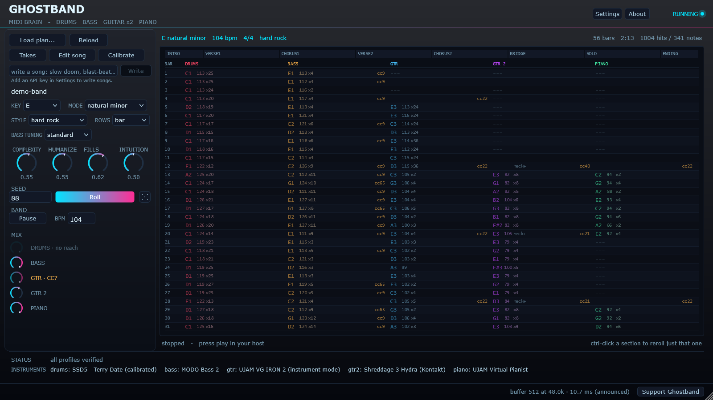

# Ghostband

**A MIDI brain that plays *your* instrument plugins to build full songs.**

> [!TIP]
> ## 🚧 Coming in version 3
>
> - **Export the song as MIDI.** One button writes everything Ghostband played
>   for the loaded song to a standard MIDI file, ready to drop into any DAW or
>   plugin: drums, bass, both guitars and piano, one track each.
> - **Edit single notes in the grid.** Change one note by hand and keep the rest
>   of the performance.
> - **More presets,** and more variations within each genre.
>
> Not built yet. Follow the [roadmap](TODO.md#version-3) or watch the repo to
> hear when it lands.

Ghostband makes no sound of its own. It writes an arrangement and **performs it
through instruments you already own** — a drum sampler, a bass, two guitars, a
piano — over MIDI, so the sounds are yours and the arranging is its job. It is a
VST3 that sits in a Gig Performer rackspace with its MIDI out wired to each
instrument.

## Download

**[Ghostband for Windows — latest release](https://github.com/mourninggrace/Ghostband/releases/latest)** —
unzip and drop the `Ghostband.vst3` folder into
`C:\Program Files\Common Files\VST3\`, then rescan plugins in your host. The songs
and instrument profiles are already inside the bundle.

> ### ▶ Press play in your host
>
> **Ghostband follows the host's transport.** With it stopped, nothing is sent and
> the plugin looks broken — in Gig Performer that is the play button in the
> toolbar. This is the single most common reason a fresh install seems to do
> nothing.

## What it does

| | |
|---|---|
| **A whole band** | Drums, bass, a rhythm guitar, a lead guitar and a piano, each on its own MIDI channel. The bass locks to the kick; the lead answers in the gaps and solos when the song says so. |
| **Your instruments** | Ships with profiles for SSD5, MODO Bass 2, UJAM Virtual Guitarist IRON 2, Shreddage 3 Hydra and UJAM Virtual Pianist, plus General MIDI. Anything else is a small JSON file, and it can calibrate an unknown instrument by ear. |
| **34 songs built in** | Hard rock, metal, thrash, groove, doom, sludge, prog, punk, alt-rock, emo, blues and ballads — each written to exercise a different part of the arranger. |
| **Roll, don't rewrite** | **Roll** plays the same song differently. Ctrl-click a section to reroll only that one; the rest is provably untouched. One seed is one song, forever. |
| **Four dials** | **Complexity**, **Humanize**, **Fills** and **Intuition** — how much the band plays what it feels like rather than what is obvious. |
| **Write a song** *(optional)* | Describe a song in a sentence and Claude writes the chart — with your own API key, encrypted on your machine. It lands as an ordinary song you can roll, edit and keep. |
| **See what it sends** | The song screen is a tracker: every note, velocity and control change, per player, per bar. Click any bar to change its chord or its section's feel. |
| **And** | Takes, ten colour themes, a dice that rolls the whole song's character (right-click puts it back), a change log of every setting you touch, and a detector that tells a host freeze from a plugin one. |

## Screenshots

| | |
|---|---|
|  |  |
| *The song screen: the arrangement, the four dials, and Write.* | *Settings: channels, MIDI learn for each instrument's own knobs, and the planner's key.* |
|  |  |
| *Click any bar to change its chord, or its section's feel.* | *The structure editor: sections, lengths and who plays where.* |
|  |  |
| *Takes: keep a performance you liked and get it back exactly.* | *One of ten themes.* |

## Honest limits

- **Windows and VST3 only.** It is developed and tested in Gig Performer 5 on one
  rig; other hosts should work and are not tested.
- **It follows the host's transport** and cannot start it.
- **No live following yet** — it plays the arrangement; it does not listen to you.
- **SSD5's volume cannot be reached over MIDI**, so the drum mix knob says so rather
  than pretending. Put a gain plugin after SSD5 to ride the drums.
- **Shreddage's per-note gestures** (rakes, pinches, harmonics) are off until the
  instrument's articulation controller is re-banded to carry them.
- **Writing songs needs your own Anthropic API key and an internet connection**,
  and each song is billed to your account. Nothing is sent without a key.

## Documentation

- **[The manual](docs/MANUAL.md)** — everything about using it, from wiring the
  rackspace to the plan file format.
- **[Changelog](CHANGELOG.md)** — what changed in every release.
- **[TODO](TODO.md)** — what is next, and what is deliberately not being done.

## Licence

Free software under the **GNU AGPLv3** — see [LICENSE](LICENSE). The engine
contains no third-party code at all; the whole licensing surface is JUCE, which
offers the same licence. If you distribute Ghostband, modified or not, you pass on
the same freedoms.

Ghostband is free and always will be. If it earns its place in your rig there is
a donate button in the plugin — a button, not a nag, and nothing is gated behind it.
