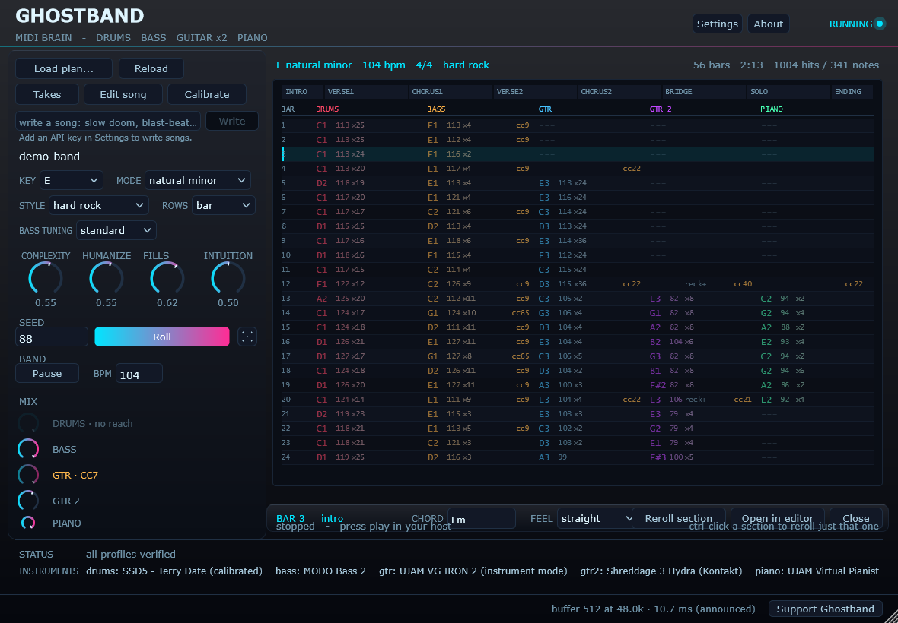
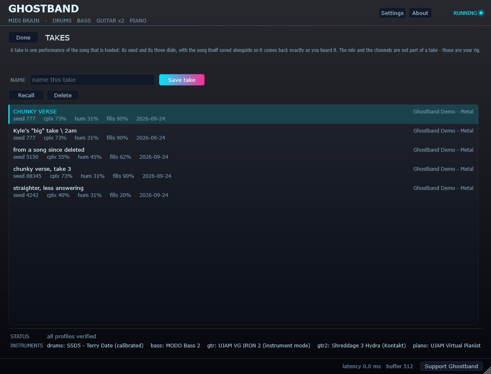
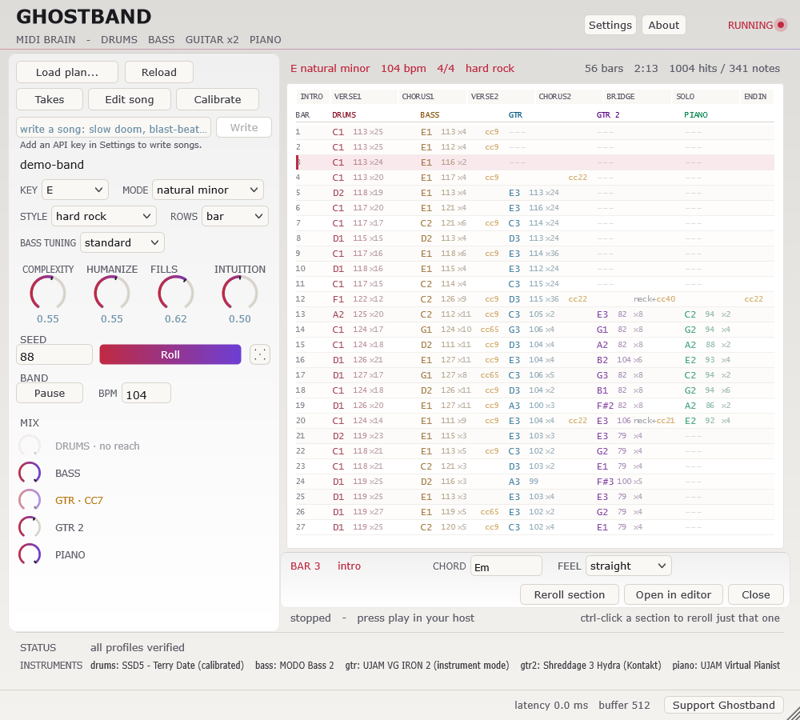

# Ghostband — the manual

Everything about using Ghostband, in the order you are likely to need it. The [README](../README.md) is the front page; this is the rest.

## The plugin

**Press play in your host first.** Ghostband follows the host transport; with it
stopped, nothing is sent and the plugin looks dead. In Gig Performer that is the
play button in the toolbar. See the note at the top.


Copy `Ghostband.vst3` into your VST3 folder, then in a Gig Performer rackspace:

1. Add Ghostband and your instruments. **It ships with a plan built in**, so it
   has a song ready the moment it loads — no file needed to hear it work.
2. In the wiring view, drag from Ghostband's **orange MIDI output pin** to the
   MIDI input of SSD5 and MODO Bass 2. One output feeds many inputs.
3. Start the transport.

Drums go out on channel 10 and bass on channel 1 by default — both set by the
driver profiles, not hardcoded. Ghostband never touches audio; it passes through
untouched so the audio pins can be left unwired.

Note that a host holds the plugin DLL open while it is loaded, so **close the
host before reinstalling** or the copy will silently leave the old build behind.

### The songs it comes with

Thirty-four presets ship inside the plugin, under **Load plan -> Presets**,
grouped by genre. They are deliberately not thirty-four versions of the same
song - each one is written to put a different part of the arranger under load.

| Song | Style | Written to show |
|------|-------|-----------------|
| Terminal Velocity | thrash, 184 | Tightness. Humanize is deliberately low. |
| Brass Hour | hard rock, 92 | The lead handover - piano leads the verses, guitar takes the choruses. |
| Last Bus Home | punk, 178 | Restraint. No piano, the sparsest fills of the eight, under eighty seconds. |
| The Long Way Round | progressive, 132 | Sections of 6, 10, 12 and 14 bars, and the lead passing four times. |
| Glass and Wire | alt rock, 138 | Loud-quiet-loud. Verses at 0.30 against choruses at 0.90. |
| Nothing Kept For Later | emo, 152 | Twelve bar choruses against eight bar verses. |
| What the House Remembers | ballad, 68 | One five minute crescendo; instruments arrive one at a time. |
| Slow Train Coming Back | blues, 86 | The shuffle. A real twelve bar, written out rather than cycled. |

All eight have a lead guitar that solos once and answers through the verses and
choruses. Where each one stays quiet is described under *Two guitars*.

A song plays at its own tempo rather than the host's, because a VST3 cannot set
the host tempo and matching it by hand for every song is a poor way to spend an
evening. The host transport still starts and stops it. There is a **Tempo:
song / Tempo: host** toggle in Settings; the cost of song tempo is that anything
else in the rackspace synced to the host will not agree with the band.

### Two guitars

A band with one guitarist loses its harmony the moment that guitarist solos.
Ghostband has a **rhythm guitar** and a **lead guitar**, on separate channels
from their own profiles, and the rhythm player keeps the riff going underneath
the solo.

Which one is "the lead" is not baked into the engine. It is whichever the
section puts out front, so the same pair can swap.

The lead guitar has three things it can do in a section:

| `guitar2` | what it plays |
|-----------|---------------|
| `solo` | a line of its own for the whole section, while the rhythm guitar holds the harmony |
| `fills` | short answering phrases in the gaps, and a soft picked arpeggio of the chord in between |
| `silent` | nothing at all |

**How it solos.** Each phrase picks a pulse - mostly eighths and quarters that
ring into each other, with fast sixteenth runs as bursts rather than the whole
fabric - and it never stands silent for a whole bar in the middle of a solo.
Measured across all 34 songs: the typical solo note is an eighth, a fifth of them
last a beat or more, and sixteenths are under a third.

**Fills are what a second guitarist does for most of a song.** Soloing is the
exception; answering the vocal line, doubling a riff into a chorus, and playing
a pickup into the next section is the job.

They use the same generator as the solos — the same devices, the same phrasing,
because a fill that phrases differently from the solos in the same song does not
sound like the same player. What changes is placement:

- **mostly** at the end of a four-bar group, where the singer stops, plus the
  last bar of the section for the run-up into what follows. The second bar is a
  real possibility, the third happens because it is unexpected, and the first is
  rare enough to be a statement
- **not** every one of those, and never two bars running. Filling every opening
  is a second solo
- out of the **front** of the bar. The riff gets the downbeat; the answer comes
  after. Where exactly varies — the half bar, the last quarter for a short
  answer, off the half for a push, and a **pickup that starts before the bar
  line and resolves inside it**
- softer, because it answers somebody rather than competing

**Between answers it is not silent.** It picks a slow arpeggio of the chord
underneath - half notes when the section is quiet, quarters in the middle,
eighths when it is loud - low in its range and softer than the answers, and it
**breaks off just before each answer** so the answer arrives as an entrance.
Until v2.0.0 it played nothing at all between answers, which measured as silence
77% of the time in a fills section, with gaps of up to 45 seconds. A guitar
that drops out should do it for a second or two and for a reason, not leave
empty space to do the talking.

Until v0.6.0 both of those were absolutes — the fourth bar, dead on the half,
every time — which made the *rhythm* of a fill identical in every song whatever
the notes were. The tendency is what was worth keeping; the rule was what made
it sound like an engine.

The **Fills** dial sets how many of the offered openings get taken. 0 silences
them across the whole song without editing a section. The **Intuition** dial
sets how far from the obvious opening it is willing to stray.

Where a song does *not* fill is as much the arrangement as where it does. None
of the shipped presets fills its intro, its first verse, a bridge, a breakdown,
or an ending — an intro is establishing something, the first verse should arrive
before the answers do, a breakdown is made of space, and an ending on open
chords wants to ring.

### Driving the instrument's own controls


*Settings. Each control is named by whoever mapped it, given a CC by MIDI Learn, and told what to follow.*


Ghostband can move an instrument's knobs, switches and selectors as the song
goes: more drive where the section is loud, a pedal in for the chorus, a
different amp each time you roll the song. It reaches them over MIDI CC, so it
works with anything that has MIDI Learn.

Mappings are built in **Settings**, not in code. Pick the instrument, press
**+ Add**, name the control whatever it is called on the plugin, then put that
control into MIDI Learn and press **Teach** — Ghostband sweeps the CC so the
instrument latches onto it. **Save mappings** writes them into the driver
profile, so they travel with it. There is no limit on how many.

Each mapping says what kind of control it is:

| type | behaviour | for |
|------|-----------|-----|
| `knob` | sweeps continuously | knobs, sliders, faders |
| `switch` | fully off or fully on | buttons, toggles, latches |
| `select` | holds one of N choices for the whole section | dropdowns, multi-position switches |

The type is about behaviour, not the widget's shape: a slider that snaps to
positions is a `select`, not a `knob`.

And what should move it:

| follows | what it does |
|---------|--------------|
| `intensity` | tracks how loud the section is |
| `lead` | up when this part leads, down when it supports |
| `peaks` | on for choruses and solos, off in the quiet sections |
| `rising` | climbs across the whole song |
| `random` | a fresh choice every section |
| `random once` | one choice held for the whole song |
| `fixed` | parked at a value you type |
| `none` | never sent, leaving the instrument as you set it |

**Ghostband suggests one when you name a control.** Choosing between eight of
these asks you to already know how the engine thinks, so the name does the work:
`volume` gets `level`, `tone` gets `lead`, `drive` gets `intensity`, `amp model`
gets `random once`, and anything that reads like a setting — `tune`, `pitch bend
range`, `invert MIDI channels` — gets `none`. The status line says which and why.

It is a suggestion. It applies once, when the control is first named, and
anything chosen by hand afterwards stands.

`random` and `random once` are for controls with no right answer — which amp,
which cabinet, which effect. They change the sound rather than the dynamics, so
the useful thing is to choose one. Both are derived from the song seed, so the
result is reproducible and rerolling rerolls it. `random once` is the one you
want for anything a band would not change mid-song.

A driven control also has a **range**, in its own units — per cent for a knob,
position numbers for a selector. Putting the higher end first inverts it, which
is the answer for a control that reads backwards. Narrowing it keeps a rolled
selector inside part of a long list.

Two buttons exist for reading an instrument back rather than driving it.
**Send** parks a control on one value and sends it once, so its display can be
read at leisure. **Walk the list** steps a selector through every position at
half a second each, which is how you find out how many choices it really has —
Teach is deliberately too fast to read.

### The controls

- **Load plan...** — a menu of every song Ghostband knows about: **Presets** by
  genre, songs **Written by the planner** (newest first, with dates), **My songs**
  (saved from Edit song), and **Browse for a file...** for anything else. The song
  playing now is ticked. A plan's own profiles come with it.
- **Reload** — re-read the current plan from disk. Edit the JSON in a text
  editor, hit Reload, hear it. Returns to the built-in plan if no file is loaded.
- **Key** — transposes the whole song. It moves written chords, not just
  generated ones; a key control that only affected auto progressions would
  silently do nothing on most plans.
- **Style / Bass tuning** — change how the band plays and how low it sits.
- **Roll** — a different take by the same band, not a different song. Same chords,
  same structure, same section lengths; different kick pattern, different backbeat
  treatment, different fill shapes, different bass approach.
  **Ctrl-click sections first to reroll only those** — the rest of the song is
  provably untouched, because every section derives its own seed. The button says
  how many are selected.
- **Complexity / Humanize / Fills / Intuition** — regenerate on their own a
  moment after you stop moving them. There is no Generate button to remember.
  **Fills** is how often the second guitar answers: 0 silences it across the
  whole song without editing a section, 1 takes every opening it is offered.
- **Intuition** is how much the band plays what it *feels like* rather than what
  is obvious, and it reaches every part rather than only the lead.

  Low: the expected note in the expected place, the same way every time. Fills
  land on the fourth bar, dead on the half, drawn from the two or three devices
  anybody learns first. The bass holds the root; the drums keep the hat shut.

  High: it anticipates the hole instead of waiting for it, varies an idea when
  it says it again, reaches for the chord rather than the scale, and steps
  outside the key and back. The bass takes the fifth; the drums lean on the
  ghost notes.

  **It is not a quality control.** A tight, literal band is the right sound for
  plenty of music and that is what the low end is. And **the middle is exactly
  what Ghostband did before the dial existed**, so leaving it alone changes
  nothing — which is how it could be added without altering a single one of the
  34 preset songs.
- **BPM** — the tempo the song is written at. See *Tempo, and whose it is*.
- **Takes** — save the performance you are hearing under a name, and get it
  back later. See *Keeping a performance you liked*.
- **Rows** — how much music one row of the grid covers: a bar, a beat, an
  eighth or a sixteenth. Nothing about the music changes, only how closely you
  are looking at it. A bar per row reads the shape of an arrangement and marks a
  busy cell `×7`; a sixteenth per row shows exactly where a hi-hat sits.
- **Mix** — one knob per part, always all five, always in the same places. A
  knob that cannot do anything is greyed with the reason written on it:
  `not in song` when the song has no such part, `no reach` when the
  instrument's volume cannot be addressed from outside at all (SSD5's cannot,
  so put a gain plugin after it in your host), and `CC7` when the knob is
  guessing with a controller most instruments ignore — teach that instrument
  its volume control in Settings and it becomes real.

  None of them are ever hidden. A control that vanishes is indistinguishable
  from one that is broken, and one silent absence makes every other control
  suspect.

### Reading the grid, and editing it



The song screen is a **tracker**: one row per bar by default, one column per
player, and the contents are what Ghostband is actually *sending* — the note,
how hard it is played, and any articulation landing there. Sections run across
the top, each as wide as it is long; click one to jump there on the next bar
line, ctrl-click to add it to a reroll.

No two neighbouring rows are the same shade, so you can count along and read a
value across a line without losing your place. The downbeat is strongest, beats
sit in the middle, and every fourth bar is marked as a phrase edge.

**Click any row** and a strip opens under the grid on that bar:

    BAR 3   intro     CHORD [Em]   FEEL [straight]
                      Reroll section | Open in editor | Close

What it offers is what is *authored*. A note in the grid is the output of a seed
and a plan, so there is nowhere to put a hand-placed one and no way to keep it
through a reroll — but the chord under a bar and the feel of its section are
exactly what decide those notes, and changing either is heard immediately.

Editing one bar of a section whose chords were chosen automatically pins the
whole section to what it was already playing and changes only that bar.
Otherwise its other bars would be free to move the next time the song
regenerated, which is not what anybody means by changing one chord.

### The dice

Beside the seed, at the end of the Roll row. **Roll** gives you a different
performance of the same song; **the dice changes the song's whole character** —
the seed, all three dials, the tempo, the key and the mode. Ctrl-click and it
picks a different preset first, so it is a different song played differently.

It rolls within musical bounds rather than at random. The tempo is *nudged* — a
quarter either way — because a tempo drawn evenly from 40 to 250 is nonsense
most of the time and the song should stay recognisably itself. The modes it
draws from lean minor, because this is a rock and metal engine.

**Right-click the die to put it back.** One step, and it exists because rolling
past one you liked with no way back is the thing that would make this
frustrating rather than fun.

### Writing a song with the AI planner

**Optional.** Everything else in Ghostband works with no key, no account and no
internet, and always will. This is for when you would rather describe a song than
pick one.


**Set up once.** You need your own Anthropic API key, from the Anthropic console.
In **Settings**, paste it into **API KEY** and press **Save key**. The field clears
itself and from then on says *saved, encrypted for this Windows user*. **Clear**
deletes it.

The key is stored with Windows' own per-user encryption (DPAPI): the file can only
be turned back into the key by the same Windows account on the same machine, so a
backup, a sync folder or a support zip that picks it up gets nothing usable. It is
never shown again, never written to the change log, and never put into a song or a
take.

**Writing a song.** On the song screen, type what you want into the box under
**Load plan** and press **Write** (or Enter):

> *slow doom that builds for three minutes and ends in a blast beat*
>
> *punk, under two minutes, no piano, a gang-vocal chorus feel*

The line under the box counts the seconds while it works; a chart can take a
minute. When it arrives it **replaces the current song straight away**, and the
model's account of what it did appears under the box. If it is longer than the
line, it ends in **... more** — click it to read all of it.
**Right-click Write to put the previous song back** — the same one step the dice
has.

To change the song on screen rather than start over, say so — *"same song, but a
bigger last chorus"*. The loaded song is always sent as context.

**What the model decides, and what it does not.** It writes the *chart*: the
sections and their lengths, the chords, key, mode, tempo, style, bass tuning, the
ending, how the intensity rises and falls, and which part plays and leads where.
It does **not** choose your plugins, your seed or your dials — a written song keeps
all of those from the song it replaced. It never writes notes: the engine plays
the chart exactly as it plays every other song, so Roll, section rerolls, the
quick-edit strip and Takes all work on it.

**Every written song is kept**, as an ordinary song file in
`Documents\Ghostband\Songs\Written`, so Reload re-reads it and a song you paid for
is never lost to the next roll.

**What is sent.** Your words; the loaded song's chart (sections, chords, key,
tempo, dial settings); and which parts your rig has. Not your plugins' file paths,
not your Windows username, not anything from your drives. The harness checks this
on every build.

**What it uses and what it costs.** By default, Claude Opus 5.5 at medium effort,
billed to your own Anthropic account per song. **Settings -> MODEL and EFFORT**
change both, and the choice holds for every session:

| Model | per million tokens, in / out |
|---|---|
| Claude Fable 5.1 — the most capable | $10 / $50 |
| **Claude Opus 5.5** — the default | $4 / $20 |
| Claude Opus 5 | $5 / $25 |
| Claude Sonnet 5 — the cheapest | $2 / $10 |

Effort runs low, medium, high, xhigh, max: how hard the model thinks before it
writes. Higher effort takes longer, costs more, and is given more room to answer.
Under the two drop-downs, Settings shows what a song costs with that model,
worked out from the token counts of the songs you have actually written. It
can't know how much longer a higher effort will make the answer, so it says so.

If the model's safety filters decline a request, Anthropic re-runs it on another
model inside the same call rather than returning nothing. That option is sent to
Fable 5.1, Opus 5.5 and Opus 5, where it is documented, and not to Sonnet 5. The change log records the tokens every song used, which is the
way to see the real cost on your account. For scale: the first real song took
23 seconds and used 3,588 tokens in and 2,261 out, about 6¢ at Claude Opus 5.5's
September 2026 prices ($4 in / $20 out per million tokens). A longer or more
detailed request costs more.

**When it goes wrong,** the line under the box says why in plain words — the key
was not accepted, the account is rate-limited or out of credit, Anthropic is busy,
there is no internet, or the model declined — and the band carries on playing
throughout. With no key saved, **Write** is greyed out and says where the key goes.

### The change log

Every change goes in `%APPDATA%\Ghostband\changes.log` as it happens, with
what it was before:

    2026-09-13 15:48:49  chord at bar 3 of intro   Dm -> Bb
    2026-09-13 15:10:54  bass level                100% -> 80%

A knob dragged across its range is one line, not one per pixel. **Show log
folder** in Settings opens the folder, which also holds your takes, your taught
mappings, and the stall log below.

### What the second guitar is told about the neck

Shreddage samples every pitch on several strings and they do not sound the same.
Left alone, the instrument places each note with its "play the chord" algorithm —
right notes, wrong voicing for a lead line.

Ghostband tells it where to play, per section, using the instrument's own
keyswitches. Nothing has to be MIDI-learned for this to work.

| section is | fretting mode | hand |
|---|---|---|
| soloing | Moving Lead — three octaves at one hand position, where the default gets two | fret 9 |
| answering | Polyphonic — every note of the answer sounds, rather than triggering legato | fret 5 |
| heavy | Polyphonic | fret 1, low and tight |

Both blocks live in `profiles/shreddage-3-hydra.json` and deleting either turns
it off. You will see these as notes in the grid's GTR 2 column — `A7` and
similar, well above anything playable. That is what is on the wire, and the grid
shows the wire.

### If the window ever freezes

Ghostband times itself. If its interface stops updating for more than a
quarter of a second, it records three things: how long the gap was, how much of
that time Ghostband itself spent working, and whether the audio thread kept
running through it. Between them those say whether it was Ghostband, your host,
or the whole plugin — and the reading appears in the bottom
right, beside the buffer reading, with the verdict in words when you hover it.

That buffer reading is **measured from what the host actually sends**, not what
it announced when it loaded the plugin. The two can differ: Gig Performer told
Ghostband 512 on a rig whose Focusrite was set to 1024. The milliseconds beside
it are how long one buffer lasts, which is the time every plugin in the chain
has to finish its work.

It is written to `%APPDATA%\Ghostband\stalls.log` too, with the date as well as
the time, because the window that would show it is the thing that was frozen.

### If Gig Performer will not quit

If Gig Performer's window closes but `GigPerformer5.exe` stays in Task Manager,
that is **Kontakt**, not Ghostband. Kontakt 8 (8.13.1, measured 2026-09-26) hangs
while it is being shut down. Loaded on its own into a test host, it finished its
work and then never let the process exit, while SSD5, MODO Bass 2, IRON 2 and
Ghostband all exited within seconds. Any rackspace with a Kontakt instrument in
it (Shreddage 3 Hydra, for one) inherits the hang.

`tools/StartGigPerformer.ps1` takes the chore away. Point your Gig Performer
shortcut at `tools/StartGigPerformer.vbs` (which runs the script without a
console window). Each time you start Gig Performer, it first ends any copy that
has no window and has been running for more than 20 seconds, and logs what it
cleared to `%APPDATA%\Ghostband\gp-launcher.log`. If a real session is already
open, it brings that one to the front instead of starting a second.
`Install.bat` applies the same rule before it installs, so a leftover cannot
block an install either; an open session is still left alone. Updating
Kontakt through Native Access is worth trying too; this was measured on 8.13.1.

### If the sound ever breaks up

The same log watches the audio. Once a second Ghostband checks that the host
asked it for as much audio as the second contained. If more than a tenth of a
second is missing, it writes an `AUDIO FELL BEHIND` line, with how much
audio was missing, how long Ghostband's own audio processing took over that
second, and its slowest single block against the time a block is allowed
(10.67 ms at 512 samples and 48 kHz). **If Ghostband's figure is a fraction of a
millisecond while a second of audio is missing, the time went somewhere else** —
another plugin, the audio driver, or Windows itself.

An interface that locks into a repeating or echoing noise until it is unplugged
is its driver replaying its last buffer after the audio stopped arriving. If that
happens, the lines around that time say whether the stop was inside Ghostband.

**It only counts a gap where the host was actually running the plugin.** A
plugin sitting in an inactive rackspace, or in a host whose audio engine is off,
gets its timer throttled to a flat 600 milliseconds — which looks exactly like a
freeze to a detector, and is nothing anybody could see, because nothing was
sounding and nothing was moving. The first two logs ran to 1,748 lines between
them, of which fourteen were real.

The test is the audio block count, which is in every line: those blocks are
counted on every buffer the host asks for, transport running or not, so **zero
of them across a gap means the host never called Ghostband at all.** That is
also the exact opposite of the fault this detector exists for — *"the playhead
is not moving but audio is still heard like normal"* has audio blocks by
definition.

Ignored gaps are still counted, and the log says so in one line rather than six
hundred. And **a gap Ghostband caused itself is always written down**, whatever
the audio was doing: if you ever see a line where `ghostband` is a big number
instead of 0.0, that one is mine.

### Keeping a performance you liked



*The take library. Five performances of one song, told apart by their numbers rather than by their names.*

Roll enough times and one of them is the one. **Takes** saves it.

A preset is a *song* — its chords, its sections, its tempo. A take is one
*performance* of that song, and the two are separate because they are recalled
for different reasons: you load a preset to play a different song, and a take to
hear the same song the way you heard it before.

Type a name, press **Save take** or hit return. **Recall** puts that performance
back and returns you to the song screen; a double-click on a row does the same
thing. Saving under a name already in the list replaces it.

What a take carries:

- the **seed**, and **complexity**, **humanize** and **fills** — the seed alone
  does not reproduce what you heard, because all four feed the same random
  stream. Seed 88345 at humanize 0.5 is a different take from the same seed at
  0.7.
- the **whole song**, stored inside the take rather than as a path to a file.
  Key, style, tempo and the chords all live in the plan, and the structure editor
  can change any of them without saving. A take that stored a path would recall a
  song that had moved on — and would die with the file if you ever deleted it.

What a take does not carry: the **mix** and the **channel assignments**. Those
are how your rig is wired rather than how the band played, and a take that
reached over and rebalanced the rack would be a surprise, not a feature.

Takes are yours — none ship with the plugin, because a factory take is just a
preset under another name. They live in
`%APPDATA%\Ghostband\takes.json`, beside the taught controls, so they survive
reinstalling and are shared by every instance in the rackspace.

### Building the song


*The structure editor. Sections are named, reordered and reshaped here, and the name is what decides how a section behaves.*


**Edit song** opens the structure editor. Click a section in the list to edit it:

- **Name** — the role is inferred from it, so renaming a section to `chorus2`
  genuinely makes it behave like a chorus.
- **Bars**, **Intensity**, **Feel**, **Fill**
- **Chords** — typed as text, e.g. `Em Em C D`. A shorter list repeats.
- **Plays** — which of drums, bass, guitar, guitar 2 and piano appear at all.

**+ Add** copies the selected section, since a new section is nearly always a
variation of the one before it. **Up** / **Down** reorder. The last section cannot
be deleted, because a song with no sections cannot render.

**Save** writes the plan back, keeping the previous version alongside it. **Save
as...** writes a new one, into `Documents\Ghostband\Songs` — your songs are kept
apart from the presets, which live inside the installed bundle under Program
Files where writing needs elevation anyway.

Editing a preset and pressing **Save** therefore does not overwrite the preset:
it becomes Save as..., offering the same name in your own folder. The presets are
the ones everybody gets, and editing one is how you start a song of your own
rather than how you replace a factory one.

A plan written by the editor and read back produces a byte-identical song — the
harness checks that round-trip on every build, because saving is only safe if it
is true.

### Jumping sections live

**Click any section to go there.** The jump is queued — the clicked section is
marked NEXT — and lands on the next bar line, so the transition stays in time
rather than lurching mid-beat. Clicking the section already playing restarts it
at the next bar, which is how you hold a chorus for another eight bars.

Every sounding note is released by name at the seam. Relying on All Notes Off
alone is not enough: it is a controller message and many instruments ignore it,
which left a note hanging across the jump until the harness caught it.

### Tempo, and whose it is

There is a **BPM** field, and a switch for whose clock the band follows.

This section used to say the opposite — that a tempo control "would be a dead
control that looks live" — because a VST3 cannot set its host's tempo; the
format has no such call. That is still true, and it is not the whole story. A
song written at 150 played at the host's 110 is not the same song, and setting
the host by hand before every preset is not a workflow.

So Ghostband keeps its own clock when told to. The host transport still starts
and stops it; only the rate comes from the plan. The cost is real and worth
knowing: anything else in the rackspace that syncs to the host — a tempo-locked
delay, say — stays on the host's tempo and will not agree with the band.

Tempo is not a playback speed here. The generators subdivide against it, so a
faster song is *arranged* differently rather than played faster.

### Why there are audio pins

There is a stereo audio in and out, and they do nothing useful. They exist
because declaring an audio bus is what makes the plugin register as a normal
effect rather than a MIDI-effect, which is what makes hosts place it sensibly.
Audio wired in passes through untouched; audio is never *routed* through
Ghostband, because a VST3 cannot see its sibling plugins' output. Wire your
instruments straight to the audio out and leave these unconnected.

They are also the hook for a later feature — a plugin that can hear what it is
producing could check its own output — but today they are vestigial.

### Colour themes



*The same song screen on Paper, the light theme.*

Eight of them, on the **Settings** screen: Ghost, Ash, Ember, Cobalt, Moss,
Oxblood, Slate and Paper. The choice is saved with the rest of the plugin state,
so it survives closing the rackspace.

A theme is not only a repaint. Every control that was handed a colour when it was
built - each label, button, combo box and text field - has to be told the new one,
because an explicit colour survives any number of look-and-feel changes. The
harness checks that: it opens the window on the dark theme, switches to the light
one, and requires every label to have moved and every one of them to still
contrast with the page behind it.

### Windows DPI

The plugin is built with `JUCE_WIN_PER_MONITOR_DPI_AWARE=0`. Without it, dragging
the editor to a monitor with different scaling left every control dead — the
window drew correctly but hit-testing used the wrong scale factor, so clicks
landed nowhere. The host owns the window, so the host should own the scaling.

## Use

```bash
build\bin\ghostband.exe render plans\demo-metal.json -o out\demo-metal.mid
```

Then in Reaper: import the `.mid`, route the drum track to SSD5 and the bass track
to MODO Bass 2. Section names appear as project markers.

Options:

| flag | meaning |
| --- | --- |
| `-o, --out <file>` | output path (default: `<plan name>.mid`) |
| `--seed <n>` | override the plan's seed without editing it |
| `--drums <file>` | drum driver profile |
| `--bass <file>` | bass driver profile |
| `--tuning <name>` | `standard`, `drop_d`, `drop_c`, `b_standard` |

## Calibration


*Calibration. It plays one voice at a time and you move the note until it sounds like what the label says.*


A driver profile is a claim about which MIDI note makes which sound, and those
claims are often wrong. The shipped SSD5 and MODO Bass 2 maps are **derived, not
verified** — the drum map uses General MIDI positions, and the MODO keyswitches
are sensible defaults rather than confirmed assignments. Everything says
`[UNVERIFIED]` for exactly that reason.

**Press Calibrate in the plugin.** It steps through every voice the kit claims to
have. Press Play to hear one; if it does not sound like a snare, press `<` or `>`
until it does — each nudge re-auditions immediately. Save writes a corrected
profile and backs up the original first.

No note numbers involved, and it works with the host transport stopped, because
identifying a hi-hat underneath a full band is impossible.

There is also `ghostband.exe calibrate`, which writes the same sequence to a MIDI
file with markers. Useful if you have a DAW; the in-plugin version is better if
you do not.

## The plan file

You own the skeleton — key, tempo, style, and the full section order. Everything
left on `auto` is what the engine decides (and later, what the AI planner decides).

### Song level

| field | values |
| --- | --- |
| `key` / `mode` | `E`, `F#`… / `natural_minor`, `harmonic_minor`, `phrygian`, `phrygian_dominant`, `dorian`, `mixolydian`, `major` |
| `bpm` | 20–300 |
| `time_signature` | `[4,4]`, `[7,8]`, `[5,4]`… |
| `style` | `hard_rock`, `metal`, `thrash`, `groove_metal`, `doom`, `sludge`, `punk`, `prog_metal`, `alt_rock` |
| `bass_tuning` | `standard`, `drop_d`, `drop_c`, `b_standard` |
| `play_style` | `pick`, `finger`, `slap` |
| `complexity` | 0–1: fills, ghost notes, dead notes |
| `humanize` | 0–1: timing and velocity looseness |
| `fills` | 0–1: how often the second guitar takes an opening. 0 is silent |
| `seed` | any integer — same seed always gives the same song |
| `ending` | `hard_stop`, `ritard`, `cymbal_ring`, `fade` |

### Section level

| field | values |
| --- | --- |
| `name` | `verse1`, `chorus2`… the role is inferred from the name |
| `bars` | length |
| `intensity` | 0–1: the single biggest lever on how the section behaves |
| `feel` | `straight`, `half_time`, `double_time`, `blast` |
| `chords` | `["Em","Em","C","D"]` — a shorter list repeats |
| `bass` | `auto`, `lock_kick`, `lock_kick_octave`, `eighths`, `sixteenths`, `roots` |
| `fill` | `auto`, `none`, `small`, `big` |
| `plays` | `full`, `none`, or a list: `drums+bass+guitar+guitar2+piano` |
| `guitar` / `guitar2` / `piano` | `auto`, `silent`, `sparse`, `muted`, `driving`, `open`, `busy`, `solo`, `fills` |
| `lead` | `auto`, `guitar`, `guitar2`, `piano`, `both` — which chordal part is out front |
| `vary` | `false` makes a repeated section bit-identical to its sibling |

A part listed in `plays` and given no phrase is **present with no instruction**,
and the engine will choose a chordal feel for it — which for the lead guitar
means comping random chords behind the band. Say what each part should do.

## Architecture

Three layers, and the boundaries between them are the point.

```
SongPlan  ──▶  Groove  ──▶  Intent  ──▶  Profile  ──▶  MIDI
 (yours)      (musical)   (abstract)   (per-plugin)
```

**Nothing about SSD5 or MODO Bass exists in the C++ source.** The generators emit
abstract intent — `kick, accent 0.8`, `bass root, palm-muted` — and a JSON driver
profile is the only thing that turns that into note numbers, keyswitches and CCs
for a specific instrument. Adding a plugin is a data file. Adding a new *role*
(guitars, keys) is engine work.

Profiles support `"inherits"`, so the five SSD5 kits share one map and state only
what differs.

### The kick/bass lock

Rock and metal live or die on whether the kick and the bass agree. Ghostband does
not generate them separately and hope: `BarGrid.kickOnsets` is built once per bar
and **both** the drum generator and the bass generator read it. They lock because
they share one source of truth.

Measured on the demo renders: metal lands 92.5% of bass attacks within 12 ticks of
a kick, averaging 2.5 ticks *ahead* of it — the small push that makes a gallop feel
urgent. Rock comes in at 53%, correctly lower, because its choruses are written to
pump straight eighths against the kick rather than mirror it.

### Determinism

The PRNG is hand-rolled xorshift32 rather than `<random>`, because the standard
distributions are not specified to give identical sequences across implementations
and a seed has to mean the same thing forever. Same plan plus same seed always
produces the same song. Section seeds are derived, so re-rolling one section
cannot disturb another.

This is more fragile than it looks, and it is worth knowing why. The generator's
RNG stream is chaotic: flip one comparison and every draw after it changes, so the
arrangement diverges completely. The plugin once held its complexity and humanize
dials as `float`; rounding 0.6 to 0.60000002 was enough to send the plugin and the
CLI down different branches and produce different songs from the same seed. They
are `double` now. **Anything that feeds a generator parameter must preserve the
exact value** — no float round-trips, no rounding for display.

### Testing

`ghostband_plugin_test` instantiates the processor with a fake playhead and walks
the whole song block by block, checking what actually leaves `processBlock`:
notes balanced, nothing emitted twice, nothing outside its block, all-notes-off on
stop, and the seed behaving.

```bash
build\ghostband_plugin_test_artefacts\Release\ghostband_plugin_test.exe plans\demo-metal.json 1231 629
```

The two trailing numbers are the drum and bass counts the CLI prints for that
plan. Passing them makes the harness hold the plugin to CLI parity — the check
that caught the float bug above.

It also caught the plugin trusting `getSampleRate()` when the host had not set it
yet: the old code fell back to 44100, which does not fail loudly, it just plays
the song at the wrong speed and drifts further out of step every block. It now
emits silence until the rate is known.

## Where this is going

### Shipped: the AI planner

It was the headline of this section for weeks, written as *"none of this is built
yet"*. It is built — see **Writing a song with the AI planner** above. It keeps
the three promises this section made for it: never a dependency (no key, nothing
changes), never a subscription (your own key and account), and never in the audio
path (its own thread; playback never waits on it).

### Still planned

- **Live following** — Ghostband comping behind what you actually play. The
  largest unbuilt idea; needs chord detection and tempo tracking.
- **A second rig, all UJAM**, so the same song can be A/B'd through two sets of
  instruments.
- **More presets**, and more variations within a genre.

The living list is [TODO.md](../TODO.md); what changed in each release is
[CHANGELOG.md](../CHANGELOG.md).

## Building it yourself

```bash
git clone --recursive https://github.com/mourninggrace/Ghostband
cd Ghostband && Build.bat
```

If you forget `--recursive`, run `git submodule update --init --recursive`. The
build tells you so rather than failing obscurely. JUCE is pinned to 8.0.15; the
C++ runtime is linked statically, so the resulting plugin has no dependencies
beyond Windows itself.

`Install.bat` copies the result into `C:\Program Files\Common Files\VST3\`,
carrying across anything you have taught or calibrated rather than overwriting
it, and removing presets that earlier versions shipped and this one does not.
Close your host first — it holds the plugin open, and a copy that silently fails
looks exactly like a fix that did not work.

## Making a release

```bash
Release.bat
```

It reads the version from `CMakeLists.txt`, refuses a dirty tree or a build that
fails its own tests, stages the bundle with the profiles and preset songs inside
it — the build output alone has neither, and would install and then be unable to
name a single instrument — and writes `out/Ghostband-<version>-win64.zip` with
its SHA256.

Then, with the version bumped and committed:

```bash
gh release create v<version> out/Ghostband-<version>-win64.zip --title "..." --notes-file <notes>
```

Releases are cut periodically, after a substantial batch of changes, rather than
on every commit.
